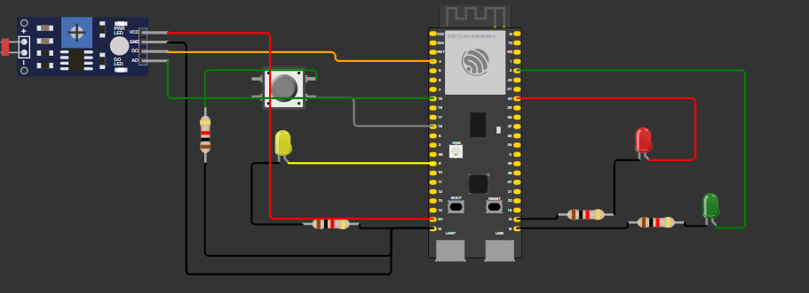

# Circuito 

O circuito estava quase todo correto, porém algumas conexões não estavam feitas, como a led vermelho que o GND não estava conectado ao GND e também o botão, que não estava ligado ao ground da maneira correta.

<div align="center">
<sub>Foto</sub><br>
<br>
</div>


## Código do projeto:

``` c++
#include <WiFi.h>
#include <HTTPClient.h>

#define led_azul 9 // Pino utilizado para controle do led azul
#define led_verde 2 // Pino utilizado para controle do led verda
#define led_vermelho 40 // Pino utilizado para controle do led vermelho
#define led_amarelo 9 // Pino utilizado para controle do led azul


const int buttonPin = 18;  // the number of the pushbutton pin
int buttonState = 0;  // variable for reading the pushbutton status

const unsigned long intervaloVermelho = 5000; // Intervalo de cada semáforo
const unsigned long intervaloAmarelo = 2000;  // Intervalo de cada semáforo
const unsigned long intervaloVerde = 3000;// Intervalo de cada semáforo
unsigned long ultimoTempo = 0; // Tempo da útlima troca
int estadoAtual = 0;           // 0 = vermelho, 1 = amarelo (após vermelho), 2 = verde


const int ldrPin = 4;  // the number of the pushbutton pin
int threshold=600;

void setup() {

  // Configuração inicial dos pinos para controle dos leds como OUTPUTs (saídas) do ESP32
  pinMode(led_azul,OUTPUT);
  pinMode(led_verde,OUTPUT);
  pinMode(led_vermelho,OUTPUT);

  // Inicialização das entradas
  pinMode(buttonPin, INPUT); // Initialize the pushbutton pin as an input

  digitalWrite(led_azul, LOW);
  digitalWrite(led_verde, LOW);
  digitalWrite(led_vermelho, LOW);

  Serial.begin(9600); // Configuração para debug por interface serial entre ESP e computador com baud rate de 9600


  // Verifica estado do botão
  buttonState = digitalRead(buttonPin);
  if (buttonState == HIGH) {
    Serial.println("Botão pressionado!");
  } else {
    Serial.println("Botão não pressionado!");
  }

  if(WiFi.status() == WL_CONNECTED){ // Se o ESP32 estiver conectado à Internet
    HTTPClient http;

    String serverPath = "http://www.google.com.br/"; // Endpoint da requisição HTTP

    http.begin(serverPath.c_str());

    int httpResponseCode = http.GET(); // Código do Resultado da Requisição HTTP

    if (httpResponseCode>0) {
      Serial.print("HTTP Response code: ");
      Serial.println(httpResponseCode);
      String payload = http.getString();
      Serial.println(payload);
      }
    else {
      Serial.print("Error code: ");
      Serial.println(httpResponseCode);
      }
      http.end();
    }

  else {
    Serial.println("WiFi Disconnected");
  }
}

void loop() {
  int ldrstatus=analogRead(ldrPin);


  if(ldrstatus<=threshold){
    Serial.print("its dark turn on led");
    //Lógica para fazer led piscar a cada segundo quando está escuro
    digitalWrite(led_amarelo, HIGH);
    delay(1000);
    digitalWrite(led_amarelo, LOW);
    delay(1000);
    Serial.println(ldrstatus);
  } else{
      unsigned long tempoAtual = millis();
    Serial.print("its bright turn off light");
     if (estadoAtual == 2 && tempoAtual - ultimoTempo >= intervaloVermelho ||
 estadoAtual == 3) {
     digitalWrite(led_vermelho, LOW);  // Desliga o vermelho
    digitalWrite(led_verde, HIGH);  // Liga o verde
    ultimoTempo = tempoAtual;        // Atualiza o tempo
    estadoAtual = 1;                 // Atualiza para o próximo estado (verde)
  }
  else if (estadoAtual == 1 && tempoAtual - ultimoTempo >= intervaloAmarelo) {
    digitalWrite(led_verde, LOW);   // Desliga o verde
    digitalWrite(led_amarelo, HIGH);    // Liga o amarelo
    ultimoTempo = tempoAtual;        // Atualiza o tempo
    estadoAtual = 0;                 // Atualiza para o próximo estado (vermelho)
  }
  else if (estadoAtual == 0 && tempoAtual - ultimoTempo >= intervaloVerde) {
    digitalWrite(led_amarelo, LOW);     // Desliga o amarelo
    digitalWrite(led_vermelho, HIGH);  // Liga o vermelho
    ultimoTempo = tempoAtual;        // Atualiza o tempo
    estadoAtual = 2;                 // Atualiza para o próximo estado (verde)
    if (buttonState ==HIGH) {
      delay(1000);
      estadoAtual = 3;
    };
  }
    Serial.println(ldrstatus);
  }
  
}

```


## Código JSON:

``` JSON

{
  "version": 1,
  "author": "Victor Hayashi",
  "editor": "wokwi",
  "parts": [
    { "type": "board-esp32-s3-devkitc-1", "id": "esp", "top": 0, "left": 0, "attrs": {} },
    {
      "type": "wokwi-led",
      "id": "led1",
      "top": 118.23,
      "left": 202.09,
      "attrs": { "color": "red" }
    },
    {
      "type": "wokwi-resistor",
      "id": "r1",
      "top": 210.86,
      "left": 132.83,
      "attrs": { "value": "1000" }
    },
    {
      "type": "wokwi-resistor",
      "id": "r2",
      "top": 219.34,
      "left": 205.56,
      "attrs": { "value": "1000" }
    },
    {
      "type": "wokwi-resistor",
      "id": "r3",
      "top": 221.06,
      "left": -129.72,
      "attrs": { "value": "1000" }
    },
    {
      "type": "wokwi-led",
      "id": "led2",
      "top": 186.32,
      "left": 271.67,
      "attrs": { "color": "green" }
    },
    {
      "type": "wokwi-led",
      "id": "led3",
      "top": 121.2,
      "left": -169,
      "attrs": { "color": "yellow" }
    },
    {
      "type": "wokwi-pushbutton",
      "id": "btn1",
      "top": 63.8,
      "left": -182.4,
      "attrs": { "color": "grey" }
    },
    {
      "type": "wokwi-resistor",
      "id": "r4",
      "top": 128.75,
      "left": -259.2,
      "rotate": 270,
      "attrs": { "value": "1000" }
    },
    {
      "type": "wokwi-photoresistor-sensor",
      "id": "ldr1",
      "top": 12.8,
      "left": -440.8,
      "attrs": {}
    }
  ],
  "connections": [
    [ "esp:TX", "$serialMonitor:RX", "", [] ],
    [ "esp:RX", "$serialMonitor:TX", "", [] ],
    [ "led3:C", "r3:1", "black", [ "h-28.32", "v66.1" ] ],
    [ "esp:9", "led3:A", "yellow", [ "h0" ] ],
    [ "r2:1", "esp:GND.4", "black", [ "v0" ] ],
    [ "r2:2", "led2:C", "black", [ "v0" ] ],
    [ "r1:2", "led1:C", "black", [ "v0" ] ],
    [ "led1:A", "esp:40", "red", [ "h48.1", "v-64.05" ] ],
    [ "r4:1", "esp:GND.1", "black", [ "h-0.85", "v95.45", "h192", "v-28.8" ] ],
    [ "btn1:2.r", "esp:18", "gray", [ "h38.6", "v29" ] ],
    [ "ldr1:GND", "esp:GND.1", "black", [ "h19.2", "v239.6", "h211.2", "v-48" ] ],
    [ "led2:A", "esp:2", "green", [ "v2.08", "h29.73", "v-163.2" ] ],
    [ "ldr1:DO", "esp:4", "orange", [ "h172.8", "v9" ] ],
    [ "esp:GND.1", "r3:2", "black", [ "h0" ] ],
    [ "esp:5V", "ldr1:VCC", "red", [ "h-168.28", "v-192.18" ] ],
    [ "esp:15", "ldr1:AO", "green", [ "h-273.88", "v-19.38" ] ],
    [ "esp:GND.3", "r1:1", "black", [ "h0" ] ],
    [ "r4:2", "btn1:1.r", "green", [ "h-0.85", "v-37.75", "h115.2" ] ]
  ],
  "dependencies": {}
}
```


Agora eu irei passar por cada estado do projeto e o que está causando eles.

### Primeiro caso: está com claridade baixa

Nesse caso, o led amarelo irá piscar com intervalos de 1 segundo.

<div align="center">
<sub>Foto</sub><br>
<br>
</div>

### Segundo caso: está com claridade alta

Nesse caso, o led verde irá ficar ligado por 3 segundos.

<div align="center">
<sub>Foto</sub><br>
<br>
</div>

Depois, o verde irá apagar e o amarelo irá permanecer ligado por 2 segundos.

<div align="center">
<sub>Foto</sub><br>
<br>
</div>

e por fim, o amarelo irá apagar e o vermelho irá permanecer ligado por 5 segundos.

<div align="center">
<sub>Foto</sub><br>
<br>
</div>


### Terceiro caso: botão foi apertato enquanto o led vermelho está ativado

Nesse caso, quando o botão for pressionado, ele irá ficar ligado por apenas mais um segundo e irá acender o verde.

<div align="center">
<sub>Foto</sub><br>
<br>
</div>

